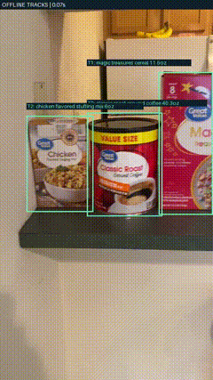

# ShelfAudit
Computer Vision–Based Retail Shelf Analysis

**Course:** CSC 410 Computational Intelligence
**Institution:** Berea College
**Author:** Luke Wilson
**Semester:** Fall 2022

## Overview

**Computer vision for reviewing product order from a handheld shelf video.**

ShelfAudit detects retail packages, identifies them against a reference catalog, connects repeated observations, and reconstructs a candidate left-to-right order. Built with PyTorch, Torchvision, and OpenCV, it explores a practical retail robotics problem: turning imperfect camera footage into evidence that a person can review.



## What it does

- Detects individual packages with a fine-tuned Faster R-CNN detector.
- Recognizes products using frozen ResNet-50 embeddings and nearest-reference retrieval.
- Associates detections across frames and stabilizes product identities with offline voting.
- Builds shelf-order constraints from products visible together.
- Preserves uncertain tracks and excluded proposals for inspection.
- Provides a local upload interface with tracked playback and evidence crops.

This is a **single-row, prerecorded-video prototype**, not a production inventory counter or a real-time robotics deployment.

## Try the sample — no GPU or weights required

From a checkout, using Python 3.9 or newer:

```bash
python -m shelf_audit.track_video examples/predictions.json --out outputs/sample_review --reconnect
```

Open `outputs/sample_review/review.html` to see the inferred order and supporting track statistics. This runs tracking and ordering on saved model predictions; it does not run fresh detection. Use a new output directory to repeat the command.

The animation above shows the full pipeline. The [sample predictions](examples/predictions.json) and [evaluation summary](examples/evaluation_summary.json) are included so the repository is useful without the private working dataset.

## Pipeline


| Component | Implementation |
|---|---|
| Detector | COCO-pretrained Faster R-CNN, MobileNetV3 FPN; frozen backbone, trained proposal and box heads |
| Recognizer | Frozen ResNet-50; 2,048-dimensional normalized embeddings; maximum cosine similarity per catalog identity |
| Tracking | Spatial overlap and translation prediction; cautious reconnection using identity evidence |
| Ordering | Repeated co-visible left/right relationships and topological ordering |
| Review | Local HTTP app, annotated H.264 video, JSON evidence, representative crops |

See [architecture](docs/architecture.md) for decisions and tradeoffs.

## Results

The catalog contains **56 reference crops across 12 products**. After development and correction of earlier failures, one frozen model was evaluated on three newly recorded videos that were not used in training.

| Fresh clip | Frames | Identified tracks / distinct identities | Persistent unknown tracks | Order status |
|---|---:|---:|---:|---|
| IMG_1849 | 278 | 12 / 12 | 0 | Review flag |
| IMG_1850 | 231 | 12 / 12 | 0 | Candidate order |
| IMG_1851 | 202 | 12 / 12 | 0 | Review flag |

All three produced the same candidate order, and the owner gave general visual approval. These clips show the **same arrangement, household, and physical packages**. Zero persistent unknowns is not perfect detection accuracy: short tracks remain, two clips retain order-evidence flags, and no exhaustive frame-level accuracy or unique-count metric was measured.

See [evaluation methodology and failure cases](docs/evaluation.md).

## Run the full pipeline

The full application additionally needs the product catalog, its index, and the trained detector checkpoint. **Raw videos, catalog images, and trained weights are not shipped in this repository.** There is no automatic dataset or checkpoint download.

The documented target environment is Windows, Python 3.10.8, PyTorch 1.13.0, Torchvision 0.14.0, OpenCV 4.6.0, and CUDA 11.7. Compatibility with these versions has not been tested; the unchanged `requirements.txt` installs the current implementation's newer dependencies:

```powershell
python -m venv .venv
.venv/Scripts/python.exe -m pip install -r requirements.txt
.venv/Scripts/python.exe -m shelf_audit.audit_app
```

Once the required artifacts are restored, open `http://127.0.0.1:8766`. See [setup and data contracts](docs/setup.md) for the artifact layout, training commands, and command-line pipeline. The sample above remains runnable without them.

## Tests

```bash
python -m unittest discover -s tests
```

With the full dependencies installed, the suite covers retrieval rejection, index integrity, detection matching, tracking, duplicate handling, ordering ambiguity, overlap cleanup, and serving-path boundaries. Tests use synthetic fixtures and do not download model weights. CI runs the suite on CPU.

## Repository layout

```text
shelf_audit/       Detection, recognition, tracking, rendering, local app
examples/          Saved predictions and fresh-evaluation summary
tests/            Unit tests (synthetic fixtures)
docs/              Architecture, setup, evaluation, preview, experiment history
.github/workflows/ CPU test workflow
```

## Limitations and next steps

Merged boxes, border fragments, duplicate tracks, camera revisits, and multi-row shelves remain open problems. A corrected detector removed extra proposals on its new training examples but reintroduced a background-bottle false positive on an older diagnostic. Identity scores and voting thresholds are heuristics, not calibrated probabilities.

Next steps are broader independently labeled footage, explicit instance-count evaluation, better handling of partial packages, and a portable artifact distribution workflow. ROS integration, sensor fusion, edge deployment, and real-time performance are outside the implemented scope.

## References

- [Torchvision object detection fine-tuning](https://docs.pytorch.org/tutorials/intermediate/torchvision_tutorial.html)
- [Torchvision ResNet-50](https://docs.pytorch.org/vision/main/models/generated/torchvision.models.resnet50.html)

Product names identify the items used in the experiment; no brand affiliation is implied.
